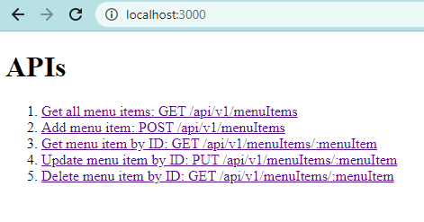

# IR Assignment 1

This is my submission for the probation period for the internship at Office of International Relations, SRMIST.

## Problem statement

### Assignment 1

Make a single RESTful API for CRUD operations in MongoDB or MySQL with a
JavaScript server like Node.js.

### Guidelines

1. The API has to be developed using JavaScript only.
2. Proper naming conventions should be followed.
3. The candidates have to create a public repository on GitHub and upload the assignment in the repository.
4. All the assets used in the assignments should be maintained in a public repository on GitHub.
5. The link to the repository should be provided in the [submission form](https://forms.gle/8zm2VPtbJcHkt7rq5).

## Installation

### Prerequisites

- [Node.js](https://nodejs.org/) v16 or above and npm.
- [MongoDB](https://www.mongodb.com/try/download/community) v6 running as a service

### Setup

1. Fork this repository or download it as a ZIP file. Extract the contents to a location of your choice.
2. Open a CLI in the root folder of the project.
3. Install the dependencies

   ```sh
   npm i
   ```

### Run the server

After startup, the logs should look like this:

```sh
Server started on port 3000.
Connected to MongoDB @ localhost
```

#### Development mode

```sh
npm run dev
```

#### Production mode

```sh
npm start
```

### Seeing the API in action

Open up [http://localhost:3000/](http://localhost:3000/) in your browser.

Click on any of the links to test out the APIs



## Tech

- Node.js
- Express
- Mongoose
- MongoDB

Developed by [DEEJ4Y](https://github.com/DEEJ4Y).
